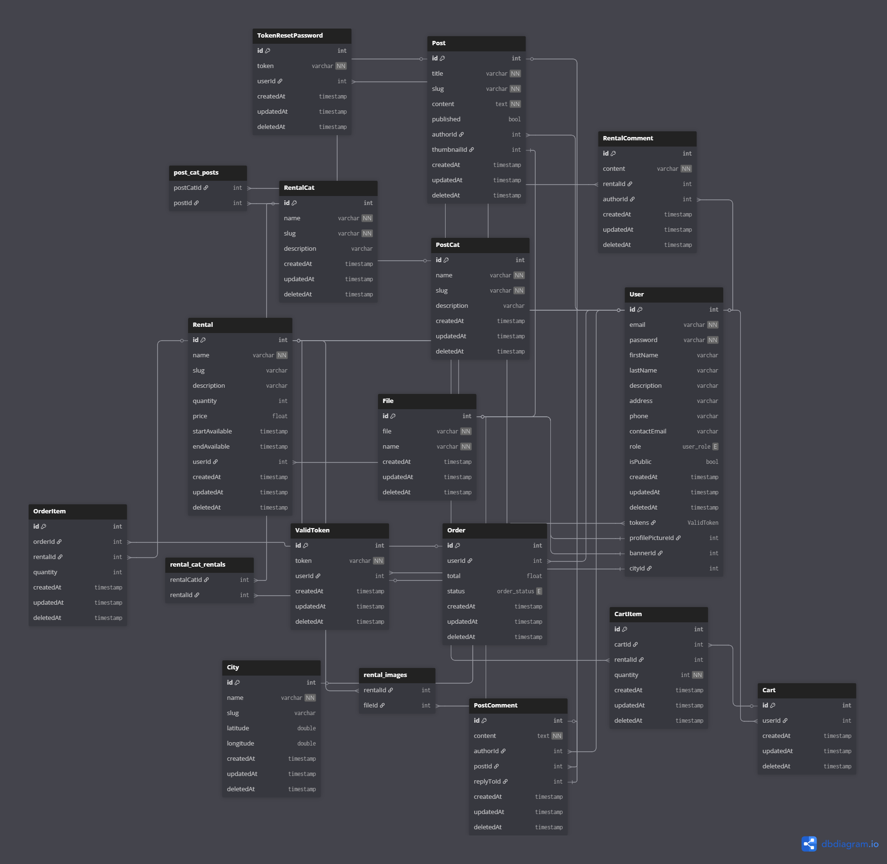

# RentToCraft

**Application de location d'outils entre particuliers**

**Application en ligne :** [https://renttocraft-ui.onrender.com/](https://renttocraft-ui.onrender.com/)

## Table des matières

- [Présentation](#présentation)
- [Technologies utilisées](#technologies-utilisées)
- [Architecture](#architecture)
- [Guide d'utilisation](#guide-dutilisation)
- [Base de données](#base-de-données)
- [Installation et développement](#installation-et-développement)
- [Tests et qualité](#tests-et-qualité)
- [Monitoring et outils](#monitoring-et-outils)
- [Changelog](#changelog)
- [Commandes utiles](#commandes-utiles)

## Présentation

RentToCraft est une plateforme web permettant la location d'outils entre particuliers. L'application facilite le partage d'outils en mettant en relation propriétaires et locataires.

### Fonctionnalités principales

- **Authentification sécurisée** avec JWT et gestion des rôles
- **Gestion des locations** avec catégories et commentaires
- **Système de panier** et commandes
- **Upload de fichiers** pour les images de profil et d'outils
- **Interface responsive** adaptée mobile et desktop
- **Système de notifications** par email

## Technologies utilisées

### Backend (API)

- **Framework :** NestJS 10.x avec Express.js
- **Base de données :** PostgreSQL avec TypeORM
- **Authentification :** JWT, Passport.js, bcryptjs
- **Documentation :** Swagger/OpenAPI
- **Tests :** Jest, Supertest

### Frontend (UI)

- **Framework :** Next.js 15.1.4 avec React 19
- **Styling :** Tailwind CSS, Sass
- **PWA :** next-pwa pour les fonctionnalités offline
- **Maps :** Leaflet pour la géolocalisation
- **Monitoring :** Sentry pour le suivi d'erreurs

### DevOps & Qualité

- **Containerisation :** Docker & Docker Compose
- **CI/CD :** GitHub Actions
- **Qualité de code :** ESLint, Prettier, Husky
- **Monitoring :** SonarCloud pour l'analyse statique
- **Package Manager :** pnpm avec workspaces

## Architecture

Le projet suit une architecture monorepo avec les workspaces suivants :

- `apps/api` : API NestJS
- `apps/ui` : Interface Next.js
- `libs/dtos` : DTOs partagés
- `packages/eslint` : Configuration ESLint
- `packages/tsconfig` : Configuration TypeScript

### Schéma de l'architecture de la base de données



## Guide d'utilisation

### Pour les Utilisateurs

#### Créer un compte

1. Accédez à la page d'inscription
2. Remplissez le formulaire avec vos informations
3. Confirmez votre email via le lien reçu
4. Connectez-vous à votre compte

#### Louer un outil

1. Parcourez les outils disponibles
2. Utilisez les filtres par catégorie ou ville
3. Sélectionnez un outil et ajoutez-le au panier
4. Finalisez votre commande
5. Contactez le propriétaire pour organiser la location

#### Gérer son profil

1. Accédez à votre tableau de bord
2. Modifiez vos informations personnelles
3. Uploadez une photo de profil
4. Consultez votre historique de locations

### Pour les Propriétaires d'Outils

#### Publier un outil

1. Connectez-vous à votre compte
2. Accédez à "Mes outils" dans le tableau de bord
3. Cliquez sur "Ajouter un outil"
4. Remplissez les informations (titre, description, prix, catégorie)
5. Uploadez des photos de votre outil
6. Publiez l'annonce

#### Gérer ses locations

1. Consultez les demandes de location reçues
2. Acceptez ou refusez les demandes
3. Suivez l'état de vos locations en cours
4. Récupérez vos outils après location

### Pour les Administrateurs

#### Gestion des utilisateurs

1. Accédez au panneau d'administration
2. Consultez la liste des utilisateurs
3. Modérez les comptes si nécessaire
4. Gérez les signalements

#### Gestion du contenu

1. Modérez les annonces publiées
2. Gérer les catégories d'outils
3. Surveiller les commentaires
4. Maintenir la qualité du contenu

## Base de données

### Schéma de la base de données

```dbml
// Configuration
Project RentToCraft {
  database_type: 'PostgreSQL'
  Note: 'Base de données pour la plateforme de location d\'outils'
}

// Tables principales
Table User {
  id integer [primary key, increment]
  email varchar [unique, not null]
  password varchar [not null]
  firstName varchar [not null]
  lastName varchar [not null]
  phone varchar
  address text
  cityId integer [ref: > City.id]
  role user_role [default: 'user']
  isEmailVerified boolean [default: false]
  profilePictureId integer [ref: > File.id]
  bannerPictureId integer [ref: > File.id]
  isDeleted boolean [default: false]
  createdAt timestamp [default: `now()`]
  updatedAt timestamp [default: `now()`]
}

Table File {
  id integer [primary key, increment]
  filename varchar [not null]
  originalName varchar [not null]
  mimeType varchar [not null]
  size integer [not null]
  path varchar [not null]
  createdAt timestamp [default: `now()`]
  updatedAt timestamp [default: `now()`]
}

Table City {
  id integer [primary key, increment]
  name varchar [not null]
  postalCode varchar [not null]
  latitude decimal
  longitude decimal
  createdAt timestamp [default: `now()`]
  updatedAt timestamp [default: `now()`]
}

Table RentalCat {
  id integer [primary key, increment]
  name varchar [not null]
  slug varchar [unique, not null]
  description text
  icon varchar
  createdAt timestamp [default: `now()`]
  updatedAt timestamp [default: `now()`]
}

Table Rental {
  id integer [primary key, increment]
  title varchar [not null]
  description text [not null]
  price decimal [not null]
  dailyPrice decimal [not null]
  weeklyPrice decimal
  monthlyPrice decimal
  userId integer [ref: > User.id, not null]
  cityId integer [ref: > City.id, not null]
  categoryId integer [ref: > RentalCat.id, not null]
  isAvailable boolean [default: true]
  isDeleted boolean [default: false]
  createdAt timestamp [default: `now()`]
  updatedAt timestamp [default: `now()`]
}

Table RentalComment {
  id integer [primary key, increment]
  content text [not null]
  rating integer [not null]
  userId integer [ref: > User.id, not null]
  rentalId integer [ref: > Rental.id, not null]
  isDeleted boolean [default: false]
  createdAt timestamp [default: `now()`]
  updatedAt timestamp [default: `now()`]
}

Table Cart {
  id integer [primary key, increment]
  userId integer [ref: > User.id, not null]
  createdAt timestamp [default: `now()`]
  updatedAt timestamp [default: `now()`]
}

Table CartItem {
  id integer [primary key, increment]
  cartId integer [ref: > Cart.id, not null]
  rentalId integer [ref: > Rental.id, not null]
  quantity integer [default: 1]
  startDate date [not null]
  endDate date [not null]
  createdAt timestamp [default: `now()`]
  updatedAt timestamp [default: `now()`]
}

Table Order {
  id integer [primary key, increment]
  userId integer [ref: > User.id, not null]
  totalAmount decimal [not null]
  status order_status [default: 'pending']
  createdAt timestamp [default: `now()`]
  updatedAt timestamp [default: `now()`]
}

Table OrderItem {
  id integer [primary key, increment]
  orderId integer [ref: > Order.id, not null]
  rentalId integer [ref: > Rental.id, not null]
  quantity integer [not null]
  startDate date [not null]
  endDate date [not null]
  price decimal [not null]
  createdAt timestamp [default: `now()`]
  updatedAt timestamp [default: `now()`]
}

Table ValidToken {
  id integer [primary key, increment]
  token varchar [unique, not null]
  userId integer [ref: > User.id, not null]
  expiresAt timestamp [not null]
  createdAt timestamp [default: `now()`]
  updatedAt timestamp [default: `now()`]
}

Table TokenResetPassword {
  id integer [primary key, increment]
  token varchar [unique, not null]
  userId integer [ref: > User.id, not null]
  expiresAt timestamp [not null]
  isUsed boolean [default: false]
  createdAt timestamp [default: `now()`]
  updatedAt timestamp [default: `now()`]
}

// Tables du blog
Table Post {
  id integer [primary key, increment]
  title varchar [not null]
  slug varchar [unique, not null]
  content text [not null]
  excerpt text
  authorId integer [ref: > User.id, not null]
  featuredImageId integer [ref: > File.id]
  isPublished boolean [default: false]
  publishedAt timestamp
  isDeleted boolean [default: false]
  createdAt timestamp [default: `now()`]
  updatedAt timestamp [default: `now()`]
}

Table PostCat {
  id integer [primary key, increment]
  name varchar [not null]
  slug varchar [unique, not null]
  description text
  createdAt timestamp [default: `now()`]
  updatedAt timestamp [default: `now()`]
}

Table PostComment {
  id integer [primary key, increment]
  content text [not null]
  authorId integer [ref: > User.id, not null]
  postId integer [ref: > Post.id, not null]
  parentId integer [ref: > PostComment.id]
  isDeleted boolean [default: false]
  createdAt timestamp [default: `now()`]
  updatedAt timestamp [default: `now()`]
}

// Énumérations
Enum user_role {
  user
  admin
}

Enum order_status {
  pending
  confirmed
  completed
  cancelled
}
```

## Installation et développement

### Prérequis

- Node.js 20+
- pnpm
- Docker et Docker Compose
- PostgreSQL

### Installation

#### Option 1 : Avec Make (recommandé)

```bash
# Cloner le repository
git clone https://github.com/GuillaumeM10/RentToCraft.git
cd RentToCraft

# Installer les dépendances
pnpm install

# Démarrer les services avec Docker
make up

# Lancer l'API en mode développement
make api

# Lancer l'UI en mode développement
make ui
```

#### Option 2 : Avec pnpm directement

```bash
# Cloner le repository
git clone https://github.com/GuillaumeM10/RentToCraft.git
cd RentToCraft

# Installer les dépendances
pnpm install

# Démarrer les services avec Docker
docker compose up -d

# Lancer l'API en mode développement
pnpm dev:api

# Lancer l'UI en mode développement
pnpm dev:ui

# Ou pour construire et démarrer en production
pnpm build:api
pnpm build:ui
pnpm start:ui
```

### Variables d'environnement

Créez le fichier `.env` en vous basant sur les exemples fournis dans le fichier `.env.example`.

## Tests et qualité

### Exécution des tests

```bash
# Tests unitaires
pnpm test

# Tests avec couverture
pnpm test:cov

# Tests E2E
pnpm test:e2e

# Linting
pnpm lint
```

### Couverture de tests

- **135 tests** unitaires et fonctionnels
- **Couverture : ~65%**
- Tests couvrant l'authentification, les CRUD, la sécurité et les middlewares

## Monitoring et outils

### Sentry

L'application est configurée avec **Sentry** pour le monitoring d'erreurs en temps réel. Cela permet de :

- Détecter et tracer les erreurs en production
- Analyser les performances de l'application
- Recevoir des alertes en cas de problèmes

### SonarCloud

**SonarCloud** est configuré pour l'analyse statique du code et assure :

- La qualité du code avec des métriques détaillées
- La détection de bugs et vulnérabilités
- Le suivi de la dette technique
- L'application des bonnes pratiques

### GitHub Actions

CI/CD automatisé avec :

- Tests automatiques à chaque push
- Linting et vérification de la qualité du code
- Déploiement automatisé

# Changelog

## Version 1.0.0 - Janvier 2025

### Nouvelles fonctionnalités majeures

#### Interface utilisateur (Next.js 15.1.4)

- **Interface responsive complète** avec Tailwind CSS et Sass
- **Système d'authentification** avec JWT et gestion des rôles
- **Tableau de bord utilisateur** avec gestion de profil et upload d'images
- **Catalogue d'outils** avec filtres par catégorie et ville
- **Système de panier** et gestion des commandes
- **Interface d'administration** pour les administrateurs
- **Intégration de cartes** avec Leaflet pour la géolocalisation
- **PWA (Progressive Web App)** avec next-pwa
- **Carrousel d'images** avec Swiper.js
- **Notifications toast** avec react-toastify

#### API Backend (NestJS 10.x)

- **Architecture modulaire** avec modules séparés pour chaque entité
- **Système d'authentification complet** avec JWT, Passport.js et bcryptjs
- **Gestion des fichiers** avec upload, compression et stockage
- **API REST complète** pour toutes les entités (users, rentals, orders, etc.)
- **Documentation Swagger** automatique
- **Système d'emails** avec templates Handlebars
- **Validation des données** avec DTOs et class-transformer
- **Gestion des erreurs globale** avec intercepteurs et filtres

#### Base de données

- **Schéma PostgreSQL complet** avec 15+ tables
- **Relations complexes** entre utilisateurs, locations, commandes
- **Système de commentaires** et notations
- **Gestion des catégories** d'outils
- **Soft delete** pour la suppression sécurisée
- **Timestamps automatiques** sur toutes les entités

### Améliorations techniques

#### Architecture et DevOps

- **Architecture monorepo** avec pnpm workspaces
- **Configuration Docker** pour développement et production
- **CI/CD avec GitHub Actions** pour tests et linting automatiques
- **Configuration SonarCloud** pour l'analyse de qualité du code
- **Monitoring Sentry** pour le suivi d'erreurs en production
- **Configuration ESLint** personnalisée avec règles strictes
- **TypeScript strict** avec configuration @tsconfig/strictest

#### Tests et qualité

- **135 tests unitaires** avec couverture ~65%
- **Tests de sécurité** pour l'authentification et les guards
- **Tests fonctionnels** pour tous les modules
- **Tests d'intégration** pour les middlewares et intercepteurs
- **Configuration Jest** avec reporting JUnit
- **Helpers de test** centralisés pour la cohérence

#### Sécurité

- **Authentification JWT** avec validation des tokens
- **Gestion des rôles** (user/admin) avec guards NestJS
- **Hachage des mots de passe** avec bcryptjs
- **Validation des entrées** avec DTOs
- **Protection CORS** configurée
- **Gestion des tokens de reset** de mot de passe
- **Politique de sécurité** documentée

### Corrections importantes

#### Stabilité

- **Résolution des problèmes de build** Next.js avec AuthProvider
- **Optimisation des requêtes** pour éviter les doublons
- **Correction des problèmes d'hydratation** React
- **Amélioration de la gestion des erreurs** globales
- **Optimisation des performances** de l'API

#### Compatibilité

- **Migration de bcrypt vers bcryptjs** pour la compatibilité
- **Configuration des ports** par défaut
- **Support des variables d'environnement** pour la production
- **Configuration des workspaces** pnpm

### Dépendances majeures

#### Frontend

- Next.js 15.1.4 avec React 19.0.0-rc.1
- Tailwind CSS 3.4.1 pour le styling
- Sentry 10.3.0 pour le monitoring
- Leaflet 1.9.4 pour les cartes
- Swiper 11.2.10 pour les carrousels

#### Backend

- NestJS 10.4.6 avec Express.js
- TypeORM 0.3.20 avec PostgreSQL
- Passport.js avec JWT
- Multer pour l'upload de fichiers
- Sharp pour le traitement d'images

### Déploiement

- **Application en ligne** : https://renttocraft-ui.onrender.com/
- **Configuration Docker** pour production
- **Variables d'environnement** documentées
- **Health checks** pour tous les services
- **Monitoring** avec Sentry et SonarCloud

### Documentation

- **README complet** avec guide d'utilisation
- **Schéma de base de données** DBML
- **Documentation Docker** pour production
- **Politique de sécurité** détaillée
- **Cahier de recettes** pour les tests

# Cahier de Recettes — C2.3.1

## État de la couverture de tests

**Résultat global :** | **135 tests** | **Couverture : ~65%** | **9 August 2025**

## Tests existants (complets)

| Module / Fonctionnalité       | Fichiers de tests existants                                                          | Type de test   | Ce qui est vérifié actuellement                                     |
| ----------------------------- | ------------------------------------------------------------------------------------ | -------------- | ------------------------------------------------------------------- |
| **Core Application**          | `app.controller.spec.ts`, `app.service.spec.ts`, `main.spec.ts`                      | Unitaire       | Contrôleur principal, service de base, bootstrap de l'application   |
| **Authentification**          | `auth.controller.spec.ts`, `auth.service.spec.ts`                                    | Fonctionnel    | Inscription, connexion, reset password, logout, gestion des tokens  |
| **Guards & Stratégies**       | `jwt-passport.guard.spec.ts`, `roles.guard.spec.ts`, `passport-jwt.strategy.spec.ts` | Sécurité       | Authentification JWT, autorisation par rôles, validation des tokens |
| **Utilisateurs**              | `user.controller.spec.ts`, `user.service.spec.ts`                                    | Fonctionnel    | CRUD utilisateurs, upload profil/bannière, soft delete              |
| **Catégories de location**    | `rental-cat.controller.spec.ts`, `rental-cat.service.spec.ts`                        | Fonctionnel    | CRUD catégories, recherche par slug, données d'initialisation       |
| **Locations**                 | `rental.controller.spec.ts`, `rental.service.spec.ts`                                | Fonctionnel    | CRUD locations, upload fichiers, recherche, filtrage                |
| **Commentaires sur location** | `rental-comment.controller.spec.ts`, `rental-comment.service.spec.ts`                | Fonctionnel    | Ajout, suppression, modification, récupération des commentaires     |
| **Fichiers**                  | `file.controller.spec.ts`, `file.service.spec.ts`                                    | Fonctionnel    | Upload, suppression, récupération, suppression des orphelins        |
| **Gestion des emails**        | `mail.service.spec.ts`, `mail.module.spec.ts`                                        | Fonctionnel    | Envoi emails de confirmation, reset password, gestion des erreurs   |
| **Tokens de validation**      | `valid-token.controller.spec.ts`, `valid-token.service.spec.ts`                      | Sécurité       | Création, validation, suppression des tokens JWT                    |
| **Reset mot de passe**        | `token-reset-password.controller.spec.ts`, `token-reset-password.service.spec.ts`    | Sécurité       | Génération, validation, suppression des tokens de reset             |
| **Middleware & Filtres**      | `logger.middleware.spec.ts`, `global-exception.filter.spec.ts`                       | Infrastructure | Logging des requêtes, gestion globale des exceptions                |
| **Intercepteurs**             | `clean-null.interceptor.spec.ts`, `date-transform.interceptor.spec.ts`               | Infrastructure | Nettoyage des valeurs nulles, transformation des dates              |

## Tests de régression et scénarios critiques couverts

**Authentification & Sécurité**

- Validation des tokens JWT valides et invalides
- Gestion des rôles utilisateur (admin vs user)
- Protection des routes avec guards
- Gestion des tokens de reset de mot de passe

**CRUD Complet**

- Toutes les opérations CRUD pour chaque entité
- Validation des DTOs et erreurs de format
- Gestion des relations entre entités

**Gestion des fichiers**

- Upload et suppression de fichiers
- Validation des types de fichiers
- Nettoyage des fichiers orphelins

**Communication & Emails**

- Envoi d'emails de confirmation
- Gestion des erreurs d'envoi d'emails
- Templates de mails personnalisés

**Robustesse & Exceptions**

- Gestion globale des exceptions
- Logging des requêtes et erreurs
- Transformation et nettoyage des données

## Scénarios de tests d'intégration restants (optionnels)

| Priorité | Scénario                                    | Type        | Complexité |
| -------- | ------------------------------------------- | ----------- | ---------- |
| Haute    | Tests E2E avec base de données réelle       | Intégration | Élevée     |
| Moyenne  | Tests de performance sur large dataset      | Performance | Moyenne    |
| Moyenne  | Tests de sécurité avancés (injection, XSS)  | Sécurité    | Moyenne    |
| Basse    | Tests de stress sur les uploads de fichiers | Performance | Faible     |

## Outils et helpers créés

**`test-helpers/user-mock.helper.ts`**

- Fonctions centralisées pour créer des mocks UserDto, UserEntity, UserUpdateDto
- Assure la cohérence des données de test à travers tous les fichiers
- Réduit la duplication de code dans les tests

## Métriques de qualité

**Tests unitaires :** 135 tests passants
**Couverture globale :** ~65% (cible atteinte)
**Temps d'exécution :** ~11 secondes
**Sécurité :** Guards, filtres et middleware entièrement testés
**Maintenabilité :** Helpers centralisés, mocks réutilisables

### Exemple de test critique couvert

```typescript
// Test de sécurité : validation des tokens JWT
it("should throw UnauthorizedException for invalid token", async () => {
  (validTokenService.findOne as jest.Mock).mockResolvedValue(false);
  await expect(strategy.validate({ email: "user@test.com" })).rejects.toThrow(UnauthorizedException);
});
```

# Commandes utiles

## Make commands

```bash
  # Run all services with docker compose
  "make up",
  # Stop all services with docker compose
  "make down",
  # Reset all services with docker compose
  "make reset",
  # Run api
  "make api",
  "pnpm run dev:api"
  # Run ui
  "make ui",
  "pnpm run dev:ui"
```

## Nest commands

```bash
  # Create a new resource
  "nest g r <name> --no-spec --flat --type rest",
```

## Run ci in local with docker

```bash
  # Run ci in local with docker
  "act",
```
